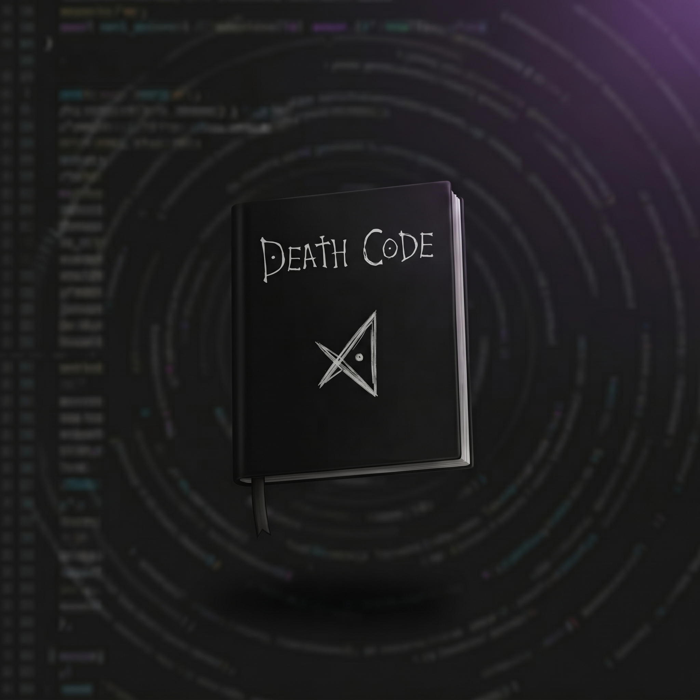
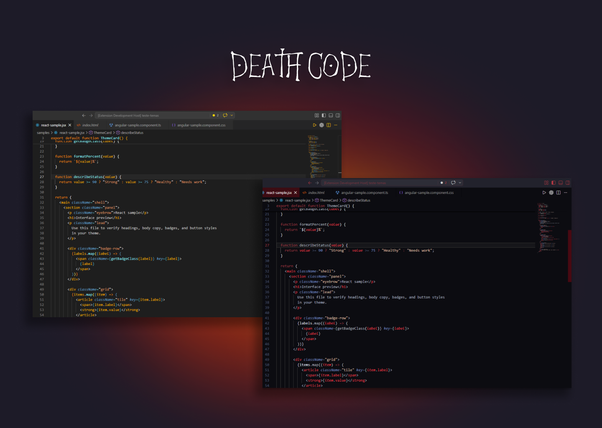
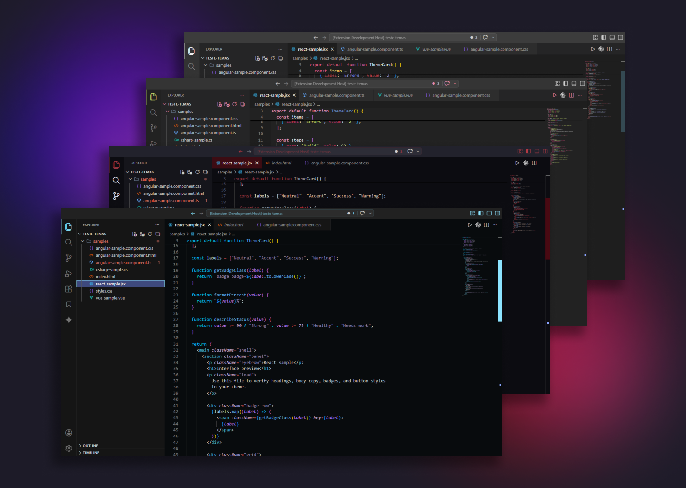

<h1 align="center">Death Code</h1>

  A collection of VS Code themes inspired by anime characters and aesthetics.

  
  
  
  

## 📓 About 

Death Code is a theme pack designed for developers who enjoy clean, modern, and visually engaging interfaces inspired by iconic anime characters.

Despite the name, this extension is not limited to Death Note.  
The name is a tribute, but the project includes themes based on multiple anime characters.

### 📓 Current themes include:
- Itachi  
- Gojo  
- Zenitsu  
- Mitsuri  
- Uzui  

More themes are coming soon, along with continuous improvements to existing ones.

---

## 📓 Preview

### Theme showcase

### Multiple themes

---

## 📓 Features

- Dark themes with carefully selected color palettes  
- Inspired by anime characters and aesthetics  
- Designed for readability and long coding sessions  
- Consistent UI and syntax highlighting  

---

## 📓 Installation

### From VS Code Marketplace

1. Open Visual Studio Code  
2. Go to Extensions (`Ctrl + Shift + X` on Windows / `Cmd + Shift + X` on macOS)  
3. Search for "Death Code"  
4. Click Install  

---

## How to Change Theme

### Windows / Linux

1. Press `Ctrl + K` then `Ctrl + T`  
2. Select your desired Death Code theme from the list  

Alternative:
- `Ctrl + Shift + P` → type `Color Theme` → select theme  

---

### macOS

1. Press `Cmd + K` then `Cmd + T`  
2. Select your desired Death Code theme  

Alternative:
- `Cmd + Shift + P` → type `Color Theme` → select theme  

---

## 📓 Roadmap

- New anime-inspired themes  
- Refinement of existing palettes  
- Possible additions of icon themes and UI tweaks  

---

## 📓 Tags

vscode, theme, dark-theme, anime, color-theme, developer-tools, itachi, gojo, zenitsu, mitsuri, uzui

---

## 📓 Notes

This project is a work in progress and will continue evolving with new ideas and improvements.

---

## 📓 License

MIT
